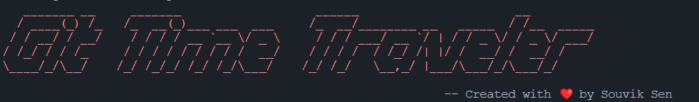
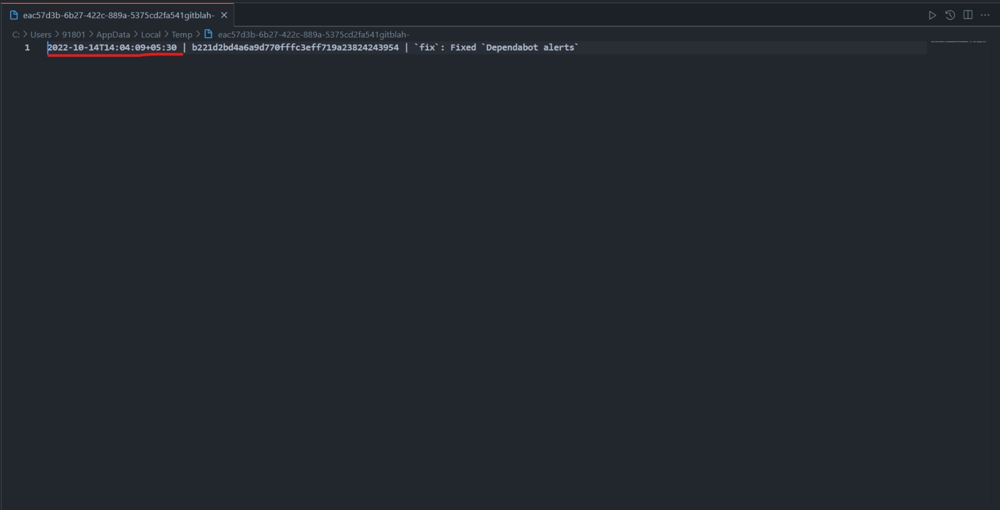

<br />
<br />


[![NPM Version][npm-image]][npm-url]
[![NPM Downloads][downloads-image]][downloads-url]
[](https://npmcharts.com/compare/git-time-travel?minimal=true)

# Git Time Travel

Git Time Travel is a powerful Node.js package that lets you manipulate the date and time of any previous Git commit in your repository. With Git Time Travel, you can easily correct mistakes or update information in your Git history without having to rewrite your entire commit history.Try Git Time Travel today and take control of your Git history!

# Prerequisite
**01 You have to use git bash to run this program. You can download git bash from [here](https://git-scm.com/downloads)**

**02 You should have a code editor like VS Code in your system.**

## Installation

### To install Git Time Travel, use npm:

```sh
$ npm install -g git-time-travel
```
This will install Git Time Travel globally on your system, making it available as a command line tool.

# Usage

Git Time Travel is a command line tool that allows you to change the date and time of previous Git commits.

To use Git Time Travel, navigate to a Git repository and run:

```bash
$ git-time-travel [options]
```
## Here are the available options for Git Time Travel:


# Options:

    `-c, --commit`:                  Numer of commits to modify. If not specified, the last 5 commits will be used.
    `-l, --limit` :                  specifies the number of chunks to split each commit into, with the default value being 20
    `-d, --debug` :                  specifies whether to enable debug mode or not
    `-a or --all` :                  specifies whether to change date for all available commits.
    `-h, --help`  :                  output usage information


# Examples
## Here are some example commands for using Git Time Travel:
### Change the date of the most recent commit to :

```bash
$ git-time-travel -c 1
```

## Code Editor will open with the following screen:


<br />
<br />

## You have to change the date from the code editor and save it then come back to the git bash and press enter.

## That's it. You have successfully changed the date of the most recent commit.


Created with ❤️ by Souvik Sen


## License

Git Time Travel is released under the [MIT](LICENSE) LICENSE.

[npm-image]: https://img.shields.io/npm/v/git-time-travel.svg
[npm-url]: https://www.npmjs.com/package/git-time-travel
[downloads-image]: https://img.shields.io/npm/dm/git-time-travel.svg
[downloads-url]: https://www.npmjs.com/package/git-time-travel