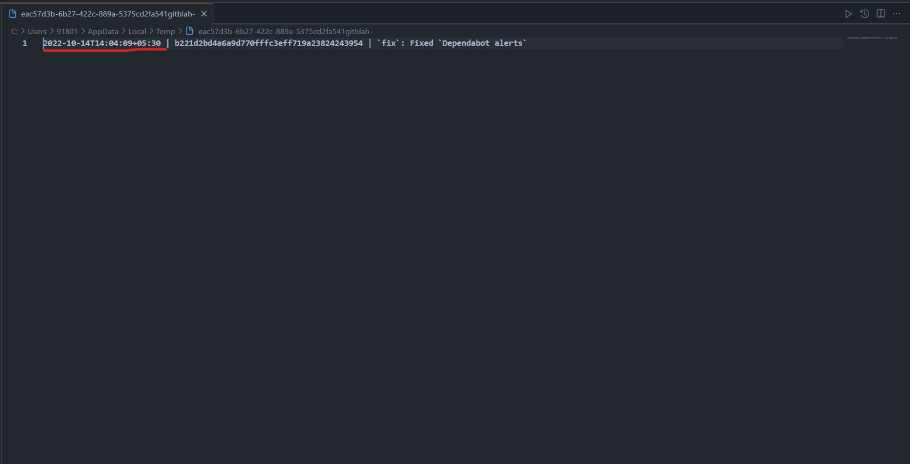

<br />
<br />


[![NPM Version][npm-image]][npm-url]
[![NPM Downloads][downloads-image]][downloads-url]
[](https://npmcharts.com/compare/git-time-travel?minimal=true)
[![Node Version][node-image]][npm-url]
[![License][license-image]][license-url]
[![CI Status][ci-image]][ci-url]

# Git Time Travel

https://user-images.githubusercontent.com/82510209/219964886-bb020c32-d13f-479b-898a-b6aa8161c542.mp4


Git Time Travel is a powerful Node.js package that lets you manipulate the date and time of any previous Git commit in your repository. With Git Time Travel, you can easily correct mistakes or update information in your Git history without having to rewrite your entire commit history.Try Git Time Travel today and take control of your Git history!

## 🚀 What's New in v2.0.0 (Major Release)

### Breaking Changes
- **⚠️ Confirmation Required**: Now asks for confirmation before rewriting history (safer!)
- **📦 Node.js 18+**: Minimum version requirement
- **✨ git-filter-repo**: Auto-detects and uses modern tool (10-100x faster)

### New Features
- **↩️ Rollback**: Undo last operation with `--rollback`
- **📝 Batch Operations**: Load changes from JSON/YAML files (`--batch`)
- **🎯 Commit Ranges**: Target specific ranges (`--range HEAD~5..HEAD~2`)
- **🔍 Advanced Filters**: Filter by author (`--author`) or message (`--grep`)
- **👤 Date Separation**: Modify only author or committer dates
- **📤 Export**: Save selections to batch files for reuse
- **📊 History**: View past operations with `--history`

**[Migration Guide](MIGRATION.md)** | **[Full Changelog](CHANGELOG.md)**

# Prerequisites

- **Git Bash** (Windows) or any bash shell (Unix/Linux/macOS). Download from [here](https://git-scm.com/downloads)
- **Node.js** version 18 or higher (**required**)
- **git-filter-repo** (optional but recommended for 10-100x performance)
- A text editor (VS Code, nano, vim, etc.) - can be configured via `--editor` flag or `EDITOR` environment variable

## Installation

### Basic Installation

```sh
$ npm install -g git-time-travel
```

### Recommended: Install git-filter-repo for Better Performance

```bash
# macOS
brew install git-filter-repo

# Ubuntu/Debian
sudo apt-get install git-filter-repo

# Fedora
sudo dnf install git-filter-repo

# Windows (via pip)
pip install git-filter-repo
```

**Note:** git-time-travel works without git-filter-repo (falls back to git filter-branch), but git-filter-repo is **10-100x faster**!

# Usage

Git Time Travel is a command line tool that allows you to change the date and time of previous Git commits.

To use Git Time Travel, navigate to a Git repository and run:

```bash
$ git-time-travel [options]
```
## Here are the available options for Git Time Travel:


# Options

## Core Options

| Flag | Description |
|------|-------------|
| `-V, --version` | Output the version number |
| `-c, --commits <number>` | Number of commits to modify (default: 5) |
| `-e, --editor <editor>` | Specify the editor to use (overrides `EDITOR` and `VISUAL` env vars) |
| `-d, --debug` | Enable debug mode for verbose output |
| `-a, --all` | Change date for all available commits |
| `-i, --interactive` | Interactive mode with commit selection |
| `-b, --backup` | Create a backup branch before making changes |
| `--dry-run` | Preview changes without modifying git history |
| `-h, --help` | Display usage information |

## 🆕 v2.0.0 Options

| Flag | Description |
|------|-------------|
| `-r, --range <range>` | Specify commit range (e.g., `HEAD~5..HEAD~2`) |
| `--author <name>` | Filter commits by author name |
| `--grep <pattern>` | Filter commits by message pattern |
| `--batch <file>` | Load operations from JSON/YAML file |
| `--export <file>` | Export current selection to batch file |
| `--generate-example [format]` | Generate example batch file (json\|yaml) |
| `--author-date-only` | Only modify author date (not committer date) |
| `--committer-date-only` | Only modify committer date (not author date) |
| `--rollback` | Rollback last operation |
| `--history` | Show operation history |
| `--use-filter-repo` | Force use of git-filter-repo (faster) |
| `--use-filter-branch` | Force use of git filter-branch (legacy) |


# Examples

### Change the date of the most recent commit

```bash
$ git-time-travel -c 1
```

### Preview changes without applying them

```bash
$ git-time-travel --dry-run
```

### Use a specific editor

```bash
$ git-time-travel --editor nano
$ git-time-travel --editor vim
```

### Modify last 10 commits

```bash
$ git-time-travel -c 10
```

### Modify all commits in repository

```bash
$ git-time-travel --all
```

### 🆕 Interactive mode with commit selection

```bash
$ git-time-travel --interactive
```

### 🆕 Create backup before modifying

```bash
$ git-time-travel --backup -c 5
```

### 🆕 Combine flags for safety

```bash
$ git-time-travel --backup --interactive --dry-run
```

## 🆕 v2.0.0 Examples

### Rollback last operation

```bash
# Made a mistake? Undo it!
$ git-time-travel --rollback

# View past operations
$ git-time-travel --history
```

### Batch operations from file

```bash
# Generate example template
$ git-time-travel --generate-example json

# Edit the JSON file with your changes
# Then apply them
$ git-time-travel --batch my-changes.json --backup
```

### Use commit ranges

```bash
# Modify specific range
$ git-time-travel --range HEAD~10..HEAD~5

# Preview first
$ git-time-travel --range HEAD~10..HEAD~5 --dry-run
```

### Filter commits

```bash
# By author
$ git-time-travel --author "John Doe" --backup

# By message pattern
$ git-time-travel --grep "fix:" --interactive

# Combine filters
$ git-time-travel --author "John" --grep "bug" --dry-run
```

### Separate author/committer dates

```bash
# Only change author dates
$ git-time-travel --author-date-only -c 5

# Only change committer dates
$ git-time-travel --committer-date-only -c 5
```

### Export and reuse

```bash
# Export current selection for later
$ git-time-travel -c 10 --export changes.json --dry-run

# Apply exported changes later
$ git-time-travel --batch changes.json --backup
```

### Force specific git tool

```bash
# Use git-filter-repo (fast)
$ git-time-travel --use-filter-repo -c 100

# Use legacy git filter-branch
$ git-time-travel --use-filter-branch -c 5
```

## How it Works

### Standard Mode

1. Run the command with your desired options
2. Code editor will open with the commit list:



3. Edit the dates in the format shown
4. Save the file and close the editor
5. Confirm when prompted
6. That's it! Your commit dates have been updated.

### Interactive Mode (NEW in v1.2.0)

1. Run with `--interactive` flag
2. Select specific commits using checkboxes
3. Edit dates in your preferred editor
4. Changes are applied only to selected commits

## Date Format

Git Time Travel supports the following date formats:
- **ISO 8601**: `2023-02-20T15:30:00+05:30` or `2023-02-20T15:30:00Z`
- **Git default**: `2023-02-20 15:30:00 +0530`
- **RFC 2822**: `Mon, 20 Feb 2023 15:30:00 +0530`
- **Unix timestamp**: `1234567890` (seconds since epoch)

## Troubleshooting

### Editor not opening

**Problem**: Error opening editor

**Solution**:
- Specify your editor explicitly: `git-time-travel --editor nano`
- Or set the `EDITOR` environment variable:
  ```bash
  export EDITOR=nano  # Linux/macOS
  set EDITOR=nano     # Windows CMD
  ```

### Invalid date format error

**Problem**: Validation errors when processing dates

**Solution**:
- Ensure dates follow the format: `YYYY-MM-DDTHH:MM:SS+HH:MM`
- Example: `2023-02-20T15:30:00+05:30`
- Don't remove the pipe separators (`|`) between date, hash, and message

### Not a git repo error

**Problem**: "Not a git repo!" error

**Solution**:
- Navigate to a git repository directory before running the command
- Verify with `git status`

### Git Bash requirement (Windows)

**Problem**: Script fails on Windows

**Solution**:
- Install Git Bash from [git-scm.com](https://git-scm.com/downloads)
- Run the command from Git Bash terminal, not CMD or PowerShell

### Force push after changes

After modifying commit dates, you'll need to force push to update the remote:

```bash
git push -f origin YOUR_BRANCH_NAME
```

⚠️ **Warning**: Force pushing rewrites history. Make sure to coordinate with your team if working on a shared branch.

## FAQ

**Q: Can I undo changes after running git-time-travel?**

A: Yes, use `git reflog` to find the previous state and reset:
```bash
git reflog
git reset --hard HEAD@{n}  # Replace n with the appropriate number
```

**Q: Is it safe to use on shared branches?**

A: Be cautious! Rewriting history on shared branches can cause issues for collaborators. Use `--dry-run` first and coordinate with your team.

**Q: Does this work with signed commits?**

A: Changing commit dates will invalidate GPG signatures. You'll need to re-sign commits if needed.


Created with ❤️ by Souvik Sen


## License

Git Time Travel is released under the [MIT](LICENSE) LICENSE.

[npm-image]: https://img.shields.io/npm/v/git-time-travel.svg
[npm-url]: https://www.npmjs.com/package/git-time-travel
[downloads-image]: https://img.shields.io/npm/dm/git-time-travel.svg
[downloads-url]: https://www.npmjs.com/package/git-time-travel
[node-image]: https://img.shields.io/node/v/git-time-travel.svg
[license-image]: https://img.shields.io/badge/license-MIT-blue.svg
[license-url]: LICENSE.md
[ci-image]: https://github.com/Yourstruggle11/git-time-travel/actions/workflows/ci.yml/badge.svg
[ci-url]: https://github.com/Yourstruggle11/git-time-travel/actions/workflows/ci.yml
